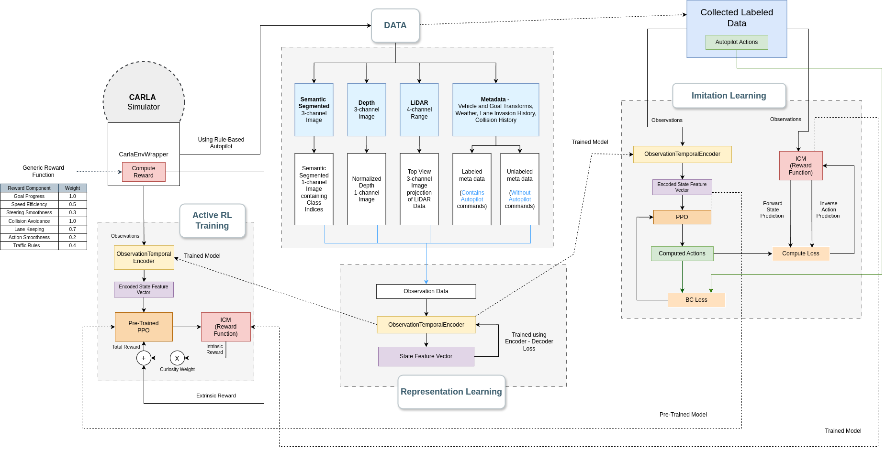
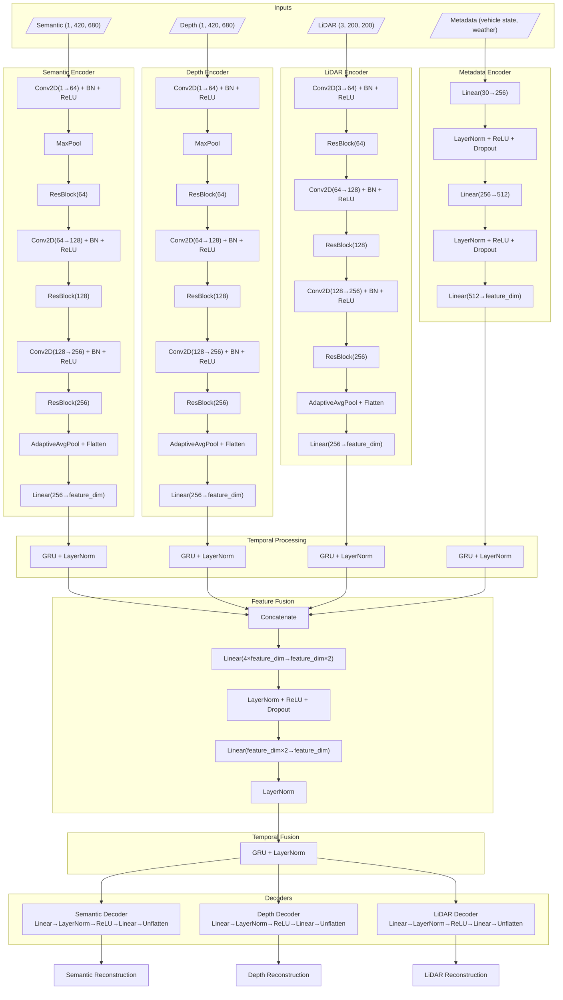
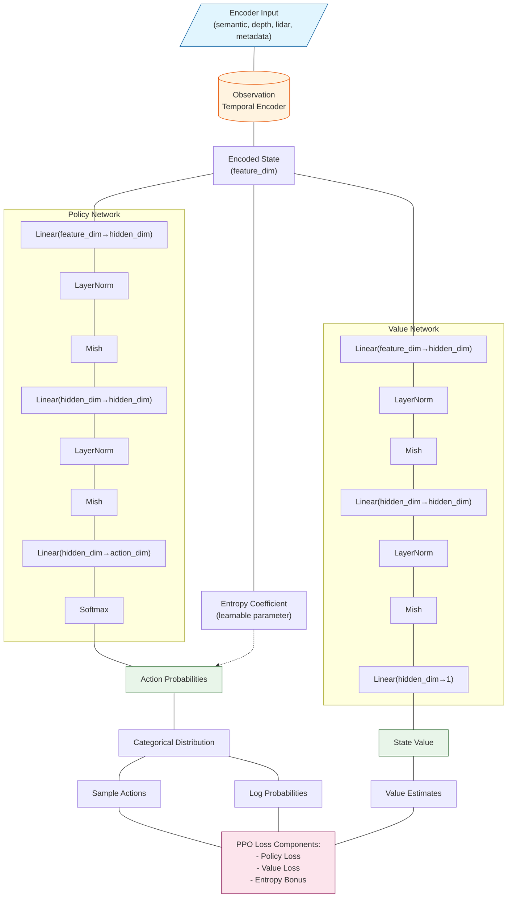
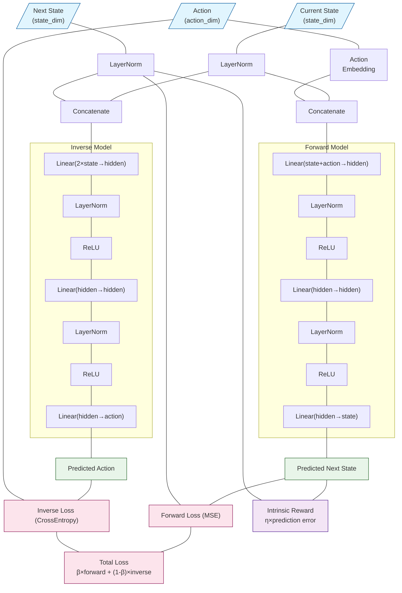
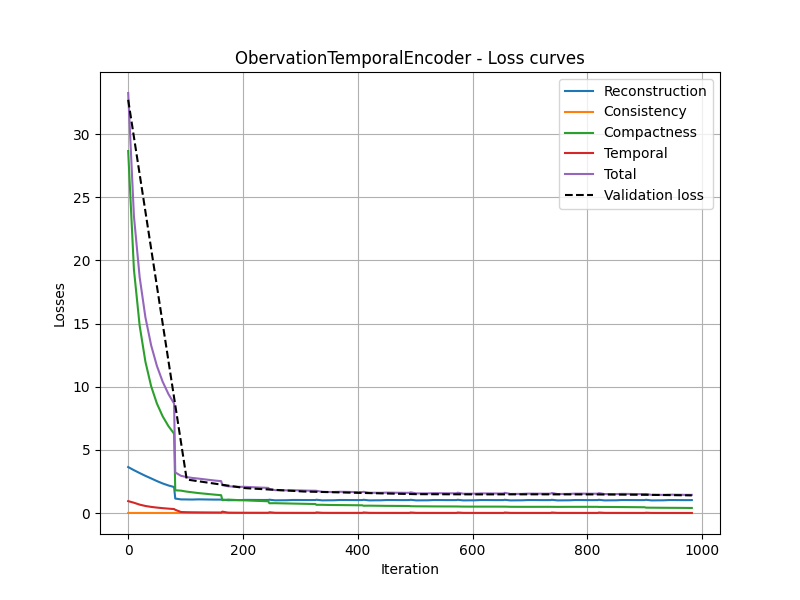
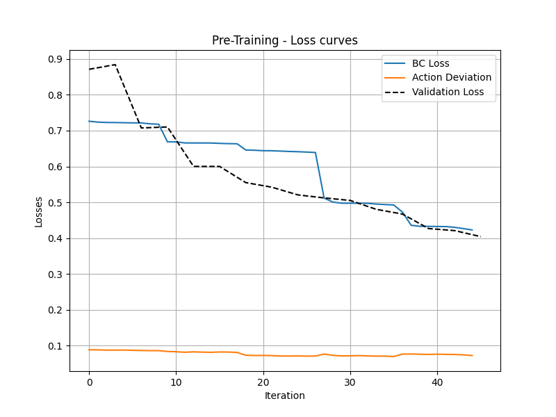
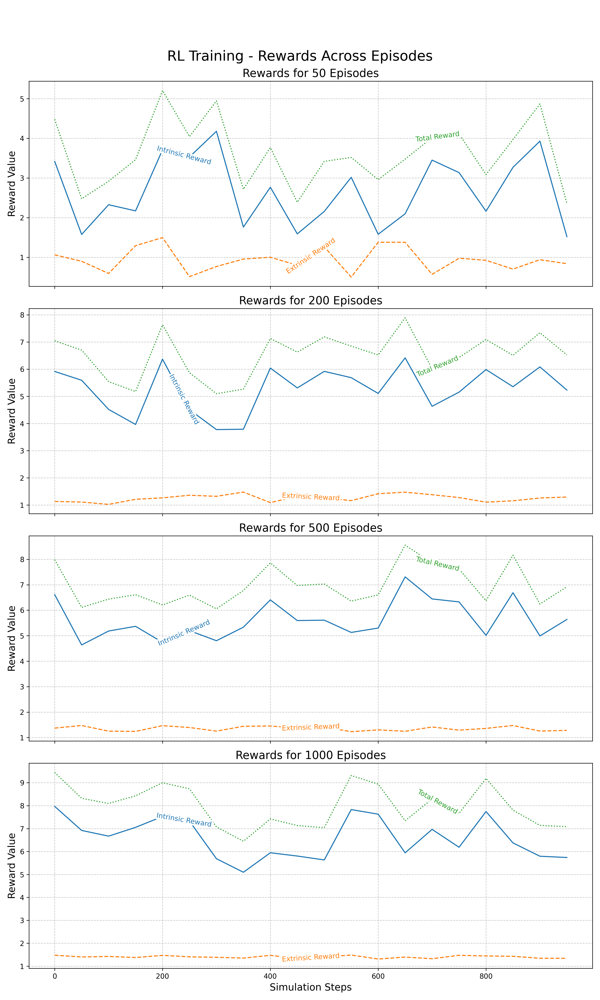

# EN.601.682 Final Project - Group 13: **Semi-Supervised Reinforcement Learning for Autonomous Agents in Dynamic Environments Using CARLA**

## **Introduction**

 Demo Video 

### **Background**

Autonomous navigation in dynamic environments is a significant challenge for robotics and AI, with applications in self-driving vehicles, delivery drones, and robotic exploration. Traditional Reinforcement Learning (RL) approaches require carefully designed reward functions and extensive labeled data, which can lead to undesired behaviors and hinder scalability.

In contrast, semi-supervised and self-supervised learning approaches can efficiently leverage partially labeled or unlabeled data to extract robust representations for downstream RL tasks. This project integrates self-supervised representation learning with curiosity-driven RL to address policy learning in dynamic environments, specifically using the CARLA simulator.

### **Problem Statement**

Learning effective driving policies in urban environments is complex due to:

- Multi-modal sensor inputs (semantic, depth, LiDAR, metadata).
- Limited labeled datasets for training.
- Environmental variability in weather, lighting, and dynamic obstacles.

Our solution leverages a semi-supervised RL framework that incorporates curiosity-driven exploration and self-supervised learning to improve adaptability and decision-making efficiency.

---

## **Methods**

### **Dataset**

The CARLA simulator is used to generate a multi-modal dataset with synchronized sensor data and diverse environmental conditions:

- **Input Modalities**:
  - RGB images (semantic segmentation).
  - Depth images (normalized to 1 channel).
  - LiDAR data (top-down 3-channel projection).
  - Metadata (autopilot commands, weather, GPS).
- **Dynamic Scenarios**:
  - Weather variations (rain, fog, night, sunny).
  - Obstacles, traffic lights, and pedestrians.
  - Multiple urban maps for testing generalization.

The dataset is preprocessed to align multi-modal inputs, making it suitable for representation learning and policy optimization.

---

### **Architecture and Training**

 System Overview 

#### Observational Temporal Encoder Architecture -

#### PPO Architecture -

#### ICM Architecture -

#### 1. **Representation Learning**

We use an **ObservationTemporalEncoder** that processes input sequences across semantic, depth, LiDAR, and metadata channels. The encoder consists of:

- Convolutional and Residual blocks for sensor data.
- Temporal GRU blocks for spatial-temporal features.
- A self-supervised loss combining reconstruction, consistency, compactness, and temporal smoothness.

#### 2. **Pre-Training with PPO and ICM**

We initialize the RL policy using **Proximal Policy Optimization (PPO)** combined with an **Intrinsic Curiosity Module (ICM)**:

- **PPO**: Ensures stable policy updates using clipped objectives.
- **ICM**: Generates intrinsic rewards based on prediction errors in state transitions, encouraging exploration of less predictable states.

The pre-training phase uses Behavioral Cloning (BC) loss to accelerate initial learning.

#### 3. **Active RL Training**

After pre-training, agents are fine-tuned in altered CARLA environments (e.g., new maps, weather conditions). The PPO-ICM framework continues to optimize the policy through real-time interactions with dynamic conditions.

The PPO objective is defined as:
\[
L^{CLIP}(\theta) = \mathbb{E}_t[\min(r_t(\theta)\hat{A}_t, \text{clip}(r_t(\theta), 1-\epsilon, 1+\epsilon)\hat{A}_t)],
\]
where \( \hat{A}_t \) is the Generalized Advantage Estimate.

#### 4. **Evaluation**

We use the **Driving Score Metric** defined as:
\[
\text{Driving Score} = R_i P_i,
\]
where:

- \( R_i \): Route completion percentage.
- \( P_i \): Weighted infraction penalties (e.g., pedestrian collisions, stop sign violations).

| **Infraction Type**           | **Penalty Coefficient** |
|-------------------------------|-------------------------|
| Collision: pedestrians        | 0.50                   |
| Collision: vehicles           | 0.60                   |
| Collision: static objects     | 0.65                   |
| Running: red light            | 0.70                   |
| Running: stop sign            | 0.80                   |

---

## **Results**

- The **ObservationTemporalEncoder** achieved a total test loss of **0.0118**.
- Pre-training was intentionally halted at **40\% BC loss** to focus on exploration efficiency.
- After **1000 episodes** of RL training, the average Driving Score reached **61.6\%** on unseen test maps with altered conditions, calculated using CARLA Leaderboard metrics.

 Observation Temporal Encoder Loss Curve  

 Pre Training Loss Curve  

 Pre Training Loss Curve  

---

## **Discussion**

Our findings demonstrate that self-supervised representation learning, combined with curiosity-driven RL, enables agents to adapt to dynamic environments with improved generalization. Key contributions include:

1. Semi-supervised latent feature learning for multi-modal sensor data.
2. Curiosity-driven exploration that reduces reliance on external rewards.
3. Robust performance in unseen environments with dynamic obstacles.

### **Future Directions**

- Explore deeper temporal models for improved sequence processing.
- Incorporate additional intrinsic reward schemes (e.g., count-based exploration).
- Scale experiments to larger CARLA maps with greater variability.

---

## **References**

1. Codevilla, Felipe, et al. "End-to-end driving via conditional imitation learning." ICRA 2018.
2. Jing, Longlong, and Yann LeCun. "Self-supervised learning for video: A survey." TPAMI 2020.
3. Pathak, Deepak, et al. "Curiosity-driven exploration by self-supervised prediction." CVPR 2017 Workshop.
4. Schulman, John, et al. "Proximal policy optimization algorithms." arXiv:1707.06347, 2017.
5. Pomerleau, Dean A. "ALVINN: An autonomous land vehicle in a neural network." NIPS 1989.
6. Kendall, Alex, et al. "Learning to drive in a day." ICRA 2019.
7. Dosovitskiy, Alexey, et al. "CARLA: An open urban driving simulator." CoRL 2017.
8. Liang, Xiaodan, et al. "CIRL: Controllable imitative reinforcement learning for vision-based self-driving." ECCV 2018.
9. Chen, Dian, et al. "Learning to drive from a world on rails." ICCV 2020.
10. Yu, Tianhe, et al. "COMBO: Conservative offline model-based policy optimization." NeurIPS 2021.
11. CARLA Leaderboard Case Study - ALPHA DRIVE, 2024.
12. CARLA Documentation: Driving Benchmark Performance Metrics, 2024.
13. CARLA Autonomous Driving Leaderboard Documentation, 2024.
14. Papers With Code - CARLA Leaderboard Benchmark (Autonomous Driving). Papers With Code, 2024.
15. Yeh, Paul. "Motion Planning on CARLA." GitHub repository, 2020.
16. Pathak, Deepak, Pulkit Agrawal, Alexei A. Efros, and Trevor Darrell. "Curiosity-driven Exploration by Self-supervised Prediction." PMLR, 2017.
17. Zhang, X., et al. "Trajectory-Guided Control Prediction for End-to-End Autonomous Driving." arXiv preprint arXiv:2206.08129v2, 2022.
18. Wu, Penghao, et al. "Trajectory-guided Control Prediction for End-to-end Autonomous Driving." GitHub repository, 2022.
19. Shaikh, Idrees. "Autonomous Driving in CARLA using Deep Reinforcement Learning." GitHub repository, 2021.
20. RobeSafe-UAH. "DQN-CARLA." GitHub repository, 2021.
21. Minelli, John. "Carla-Gym: Multi-Agent RL Interface for CARLA." GitHub repository, 2022.
22. Luca96. "CARLA Driving RL Agent." GitHub repository, 2021.

---
