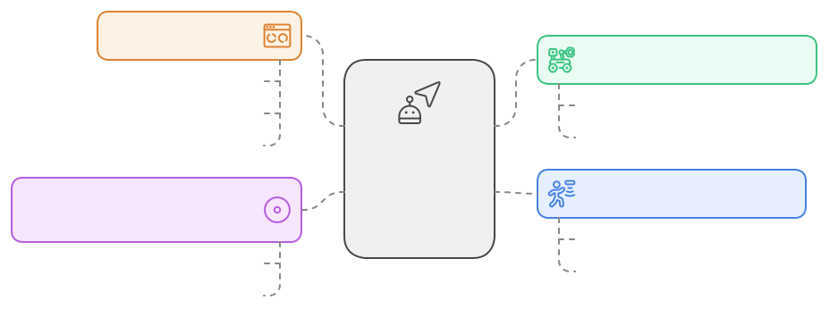

# EN.601.682 Final Project - Group 13: **Semi-Supervised Reinforcement Learning for Pathfinding Agents in Dynamic Environments Using CARLA**

## **Introduction**

### **Problem Statement**

Pathfinding in dynamic environments is a critical challenge for autonomous navigation systems. Agents must make real-time decisions to balance objectives like minimizing travel time and avoiding obstacles. Traditional reinforcement learning (RL) approaches often require extensive datasets and carefully crafted reward functions, which can lead to undesired behaviors.

Recent advances in curiosity-driven exploration offer a promising alternative by rewarding agents for exploring novel situations. This approach has the potential to outperform supervised methods while reducing the need for annotated data. The CARLA simulator provides a realistic urban environment for testing and developing these approaches.

## **Methods**

### **Dataset**

The project will utilize the CARLA Autonomous Driving Simulator, which provides a realistic urban environment ideal for testing RL algorithms in autonomous driving scenarios. The dataset includes:

-   **Sensor Data**: LiDAR, depth images, RGB images, and GPS coordinates.
-   **Ground Truth Labels**: Information on roads, obstacles, and navigation objectives.
-   **Dynamic Scenarios**: Diverse conditions with dynamic obstacles and variable environments.

This dataset allows for effective training of RL agents to adapt to new situations, improving their decision-making capabilities in real-time pathfinding tasks. The diverse scenarios ensure that agents can generalize across different environments.

We draw inspiration from the [2023](https://opendrivelab.com/challenge2023/) and [2024](https://opendrivelab.com/challenge2024/#carla) CARLA Autonomous Driving Challenge entries to enhance our evaluation process.

### **Proposed Solution**

The CARLA simulator allows the creation of dynamic environments with various traffic conditions and obstacles, providing a robust platform for developing pathfinding agents. Our solution addresses the challenges of data-hungry deep networks and hand-crafted reward functions by focusing on curiosity-driven exploration.

#### **Key Components:**

1. **Curiosity-Driven Exploration**: Inspired by recent research, this approach rewards agents for exploring new states within the CARLA environment. It encourages diverse experience collection and reduces reliance on external reward signals.
2. **Semi-Supervised Learning**: We integrate semi-supervised learning techniques to enhance learning efficiency by combining unsupervised exploration with minimal supervision.
3. **Proximal Policy Optimization (PPO)**: A stable policy update mechanism where intrinsic rewards are based on the novelty and diversity of explored states.
4. **Evaluation Metrics**: Agent performance will be evaluated through:
    - Exploration efficiency
    - Task completion rates
    - Visualizations illustrating how curiosity-driven strategies influence decision-making and pathfinding efficiency.

## **References**

1. Yeh, Paul. "Motion Planning on CARLA." GitHub repository, 2020.
2. Pathak, Deepak et al., "Curiosity-driven Exploration by Self-supervised Prediction." Proceedings of the 34th International Conference on Machine Learning-Volume 70, 2017.
3. Zhang, X. et al., "Trajectory-Guided Control Prediction for End-to-End Autonomous Driving." arXiv preprint arXiv:2206.08129v2, 2022.
4. Wu, Penghao et al., "Trajectory-guided Control Prediction for End-to-end Autonomous Driving: A Simple yet Strong Baseline." GitHub repository, 2022.
5. Shaikh, Idrees. "Autonomous Driving in CARLA using Deep Reinforcement Learning." GitHub repository, 2021.
6. RobeSafe-UAH. "DQN-CARLA." GitHub repository, 2021.
7. Minelli, John. "Carla-Gym: Multi-Agent RL Interface for CARLA." GitHub repository, 2022.
8. Luca96. "CARLA Driving RL Agent." GitHub repository, 2021.
